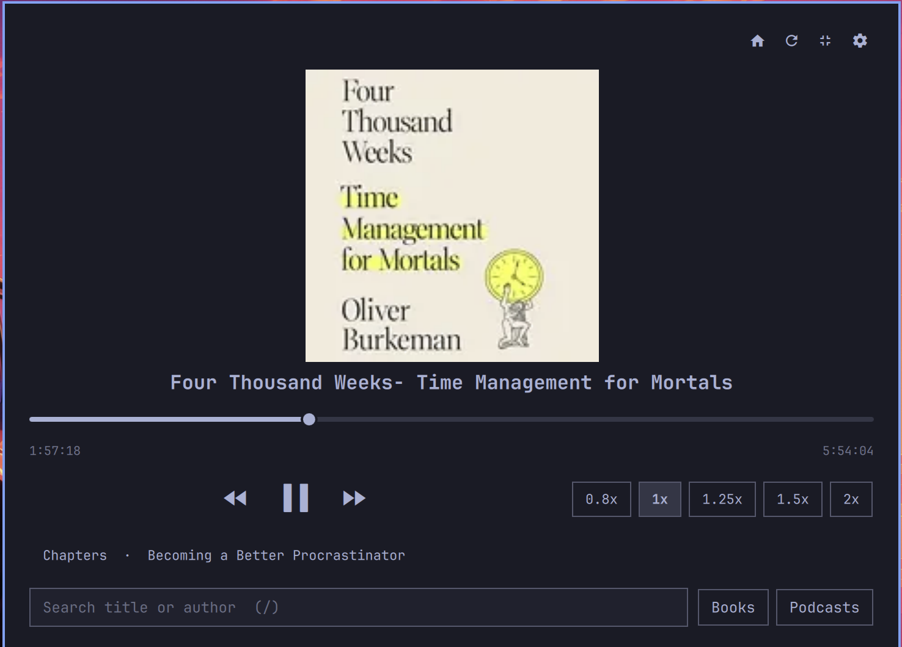
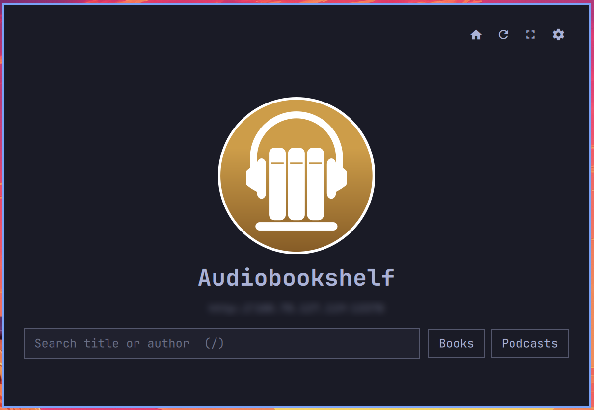
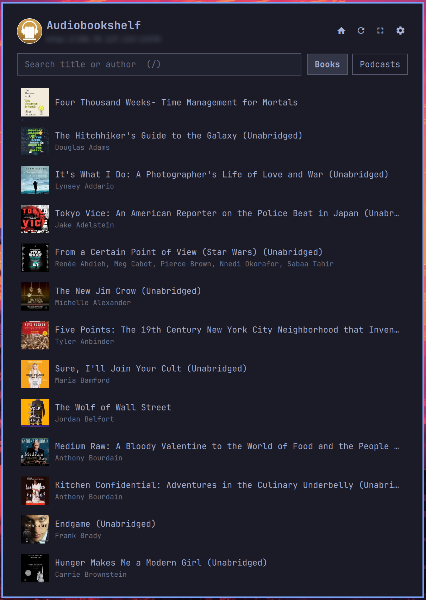
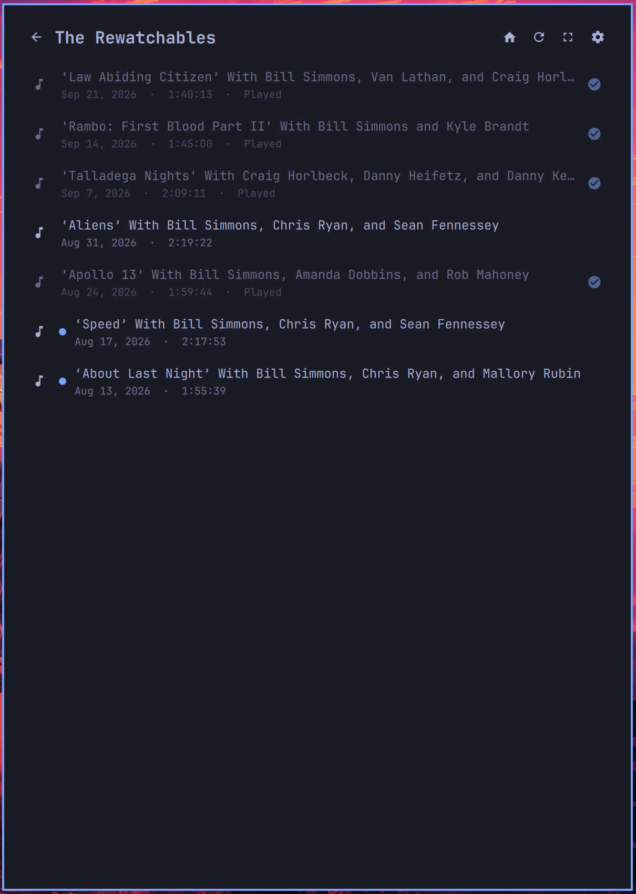

# Audiobookshelf for Omarchy

An [Audiobookshelf](https://www.audiobookshelf.org/) client that lives in the
Omarchy bar. Browse your books and podcasts, pick up where you left off, and
control playback from a dropdown that matches your Omarchy theme.

*An independent client. Not affiliated with or endorsed by the Audiobookshelf project.*

| Now playing | Home |
|---|---|
|  |  |

## Features

- **Dropdown player:** a large player on the home view (cover, seek bar, ±30s,
  play/pause, speed) with search and Books / Podcasts underneath. Pop it out to
  half the screen from the header.
- **Library:** books and podcasts with cover art. Search covers title and
  author across both types.
- **Resume everywhere:** playback starts at your saved position and syncs back
  to the server every 15 seconds and on pause, so the phone app and web player
  stay in step.
- **Chapters:** jump to any chapter; the current one is shown next to the button.
- **Podcasts:** open a show to see its episodes, newest first. Never-played
  episodes get a dot, shows get an "N unplayed" count, and each episode has
  collapsible show notes.
- **Mark finished:** right-click a book or episode to mark it finished (or not).
- **Themed:** the bar icon, fonts, colors and controls come from the shell's own
  theme, so it follows whatever Omarchy theme you switch to.
- **Books-only or podcasts-only servers work too:** libraries are detected at
  login, and only the types you have are shown.

| Library | Podcast episodes | Search |
|---|---|---|
|  |  |  |

## Requirements

- An Audiobookshelf server you can log into
- [mpv](https://mpv.io/), installed from your distribution's `mpv` package (setup checks for it)
- `python3` and `secret-tool` (both ship with Omarchy)

## Install

```
omarchy plugin add https://github.com/jtcarrasco/omarchy-audiobookshelf --enable
```

If the headphones icon doesn't appear, add **Audiobookshelf** to your bar in the
shell's bar settings.

## Setup

1. Click the headphones icon. The first time, the dropdown shows a connect form.
2. Enter your server URL (e.g. `http://localhost:13378`), username and password.
3. The plugin logs in, finds your book and podcast libraries, and shows your
   library. If you have more than one library of a type, pick which one to use
   from the settings (gear) page.

Your password is only sent to your server to get a login token. The token is
stored in the system keyring (`secret-tool`); only the server URL and library
IDs are written to `~/.config/audiobookshelf-plugin/config.json`.

### Switching servers or disconnecting

- **Switch server or account:** open the settings (gear) page and connect
  again. The new login replaces the old one.
- **Disconnect:** on the settings (gear) page, click **Disconnect** twice to
  confirm. It stops playback and removes the saved login token and settings
  from this computer; your account and progress stay on the server.

## Usage

**Bar icon**
- Left-click: open or close the dropdown
- Middle-click: play / pause
- The icon lights up when new podcast episodes are found, and dims if the
  server can't be reached.

**In the dropdown**
- Click a book to play it, or a podcast to see its episodes
- Right-click a book or episode to mark it finished / not finished
- Header: home, refresh, pop out to half the screen, settings

**Keyboard** (while the dropdown is open)

| Key | Action |
|---|---|
| `/` | Search |
| Space | Play / pause |
| `r` | Refresh the library |
| Esc | Back (episodes or settings), then close |

The dropdown can also be driven over IPC, e.g. from a Hyprland keybinding:

```
omarchy-shell abs-player toggle
omarchy-shell abs-player playPause
omarchy-shell abs-player browse book      # or: podcast
omarchy-shell abs-player search "hitchhiker"
omarchy-shell abs-player openPodcast "rewatchables"
omarchy-shell abs-player home
omarchy-shell abs-player popOut          # open in its own window
```

## Settings

- **Check for new episodes every:** how often the plugin checks your podcast
  library in the background (10–60 minutes, default 20, jittered).

## Uninstall

```
omarchy plugin remove abs-player
```

The login token and local config aren't removed automatically:

```
secret-tool clear service abs-plugin
rm -rf ~/.config/audiobookshelf-plugin ~/.local/state/audiobookshelf-plugin
```

## Known limitations

- **Multi-file books play their first file only.** Most audiobooks are a single
  file (m4b/mp3) and work fully; books split into several files don't yet
  continue past the first one.
- **The new-episode check notices new shows, not new episodes of shows you
  already have.** The per-show "N unplayed" count in the dropdown is accurate;
  it's the background notification that's coarse.
- **No sleep timer yet.**
- **Speed isn't remembered per book.** It resets to 1x for each new item.

## How it works

- `BarWidget.qml`: the bar icon; hosts the dropdown.
- `Panel.qml`: the dropdown UI, built on the shell's `qs.Ui` components and
  `qs.Commons` theme.
- `Player.qml` / `MpvPlayer.qml`: one mpv process controlled over its JSON IPC
  socket (in `$XDG_RUNTIME_DIR`), resume and progress sync.
- `scripts/abs_backend.py`: every Audiobookshelf API call (login, libraries,
  items, episodes, progress, covers), standard library only.

## Development

```
uv run --with pytest --with pyside6 python -m pytest tests
```

`tests/test_abs_backend.py` covers the backend with no network access;
`tests/test_model.py` loads `Model.js` in a real QML engine.

## License

MIT, see [LICENSE](LICENSE).
